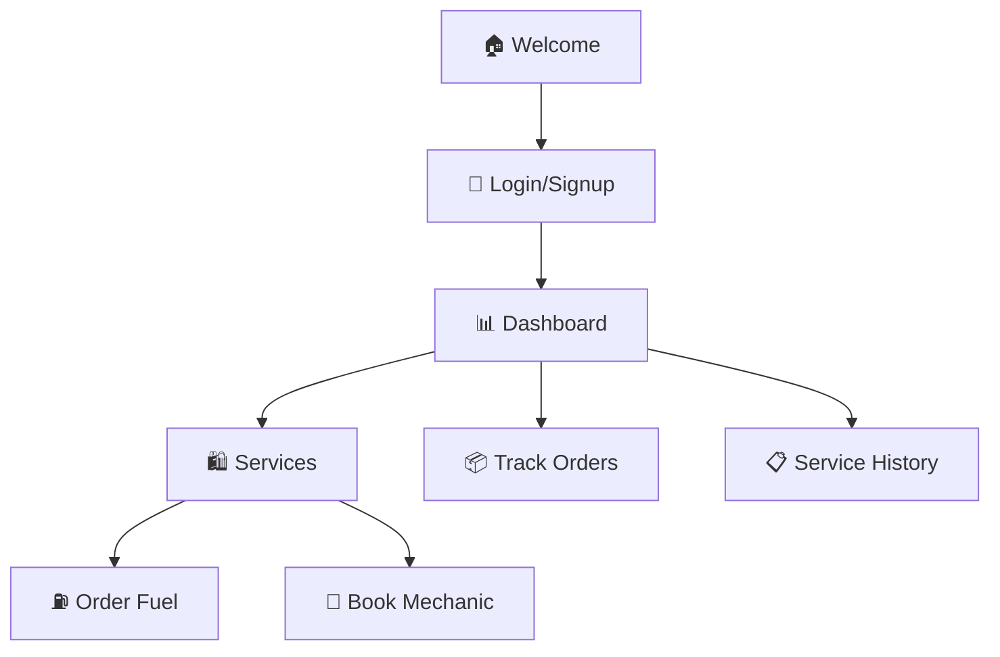

<div align="center">

# 🚛⛽ PetroServe
### *Your On-Demand Fuel & Automotive Services Platform*

[](https://petroserve.vercel.app)
[](https://vercel.com)

[](https://reactjs.org/)
[](https://www.typescriptlang.org/)
[](LICENSE)
[](CONTRIBUTING.md)

*A sleek, modern web application revolutionizing fuel delivery and automotive services with real-time tracking, intuitive UI, and seamless user experience.*

</div>

---

## 🎯 **Live Application**

🌐 **[Experience PetroServe Live →](https://petroserve.vercel.app)**

> **Demo Credentials:** `demo@petroserve.com` / `demo123`

---

## ✨ **Key Features**

<table>
<tr>
<td width="50%">

### ⛽ **Fuel Delivery**
- 🚚 On-demand fuel delivery to your location
- ⏰ Real-time order tracking & live updates
- 🎯 Multiple fuel types (Petrol, Diesel, Premium)
- 📅 Schedule recurring deliveries

</td>
<td width="50%">

### 🔧 **Mechanic Services**
- 🚗 Mobile mechanic booking for on-site repairs
- 🆘 24/7 emergency roadside assistance
- 📋 Complete service history tracking
- 👨‍🔧 Certified professional mechanics

</td>
</tr>
</table>

### 💎 **Modern Experience**
- 📱 **Fully Responsive** - Perfect on mobile, tablet & desktop
- ⚡ **Lightning Fast** - Optimized performance with 89.13 kB bundle
- 🎨 **Beautiful UI/UX** - Professional design with intuitive navigation
- 🔐 **Secure Authentication** - Protected routes and data encryption

---

## 🚀 **Quick Start**

### **🌐 Try Live Demo (Fastest)**
```bash
👆 Click the "Live Demo" button above
📧 Login: demo@petroserve.com
🔑 Password: demo123
```

### **💻 Run Locally**
```bash
# Clone repository
git clone https://github.com/yourusername/petroserve.git
cd petroserve

# Install dependencies
npm install

# Start development server
npm start

# Open http://localhost:3000
```

### **🏗️ Build for Production**
```bash
npm run build
# Optimized build ready in /build folder
```

---

## 🎭 **Screenshots & Demo**

<div align="center">

### 🏠 **Welcome Experience**
*Professional landing page with modern design*

### 📊 **Smart Dashboard**
*Intuitive control center for all your services*

### 🛍️ **Seamless Ordering**
*One-click fuel delivery and mechanic booking*

### 📱 **Mobile First**
*Perfect experience across all devices*

</div>

---

## 🛠️ **Tech Stack**

<div align="center">

| Frontend | Tools | Deployment |
|:--------:|:-----:|:----------:|
|  |  |  |
|  |  |  |

</div>

---

## 📱 **Application Pages**



---

## 🎨 **Design System**

<div align="center">

### **🎯 Brand Colors**
 **Primary Red** `#DC2626`
 **Success Green** `#00D46A`
 **Elegant Black** `#000000`

### **⚡ Performance**
- Bundle Size: **89.13 kB** (gzipped)
- Load Time: **< 2 seconds**
- Lighthouse Score: **95+**

</div>

---

## 🚀 **Deployment**

### **📋 Deployment Status**
- ✅ **Production**: Deployed on Vercel
- ✅ **HTTPS**: Automatic SSL certificate
- ✅ **Global CDN**: Worldwide distribution
- ✅ **Auto Deploy**: On every Git push

### **🔄 Deploy Your Own**

<div align="center">

[](https://vercel.com/new/clone?repository-url=https://github.com/yourusername/petroserve)
[](https://app.netlify.com/start/deploy?repository=https://github.com/yourusername/petroserve)

</div>

---

## 📂 **Project Architecture**

```
🏗️ petroserve/
├── 📁 public/                 # Static assets
│   ├── 🖼️ favicon.ico
│   ├── 📄 index.html
│   └── 📱 manifest.json
├── 📁 src/
│   ├── 🧩 components/         # React components
│   │   ├── 🏠 Welcome.tsx     # Landing page
│   │   ├── 🔑 Login.tsx       # Authentication
│   │   ├── 📊 Dashboard.tsx   # User dashboard
│   │   ├── 🛍️ Services.tsx    # Services hub
│   │   ├── ⛽ OrderFuel.tsx   # Fuel ordering
│   │   ├── 🔧 BookMechanic.tsx # Mechanic booking
│   │   └── 📦 TrackOrder.tsx  # Order tracking
│   ├── 🎯 App.tsx             # Main application
│   └── 🚀 index.tsx           # Entry point
├── ⚙️ package.json            # Dependencies
├── 🔧 tsconfig.json           # TypeScript config
└── 📚 README.md               # Documentation
```

---

## 🤝 **Contributing**

We welcome contributions! Here's how you can help:

1. 🍴 **Fork** the repository
2. 🌿 **Create** your feature branch (`git checkout -b feature/amazing-feature`)
3. 💾 **Commit** your changes (`git commit -m 'Add amazing feature'`)
4. 📤 **Push** to the branch (`git push origin feature/amazing-feature`)
5. 🔄 **Open** a Pull Request

---

## 📜 **License**

This project is licensed under the **MIT License** - see the [LICENSE](LICENSE) file for details.

---

## 🌟 **Support & Community**

<div align="center">

### **💬 Get Help**
[](https://github.com/yourusername/petroserve/issues)
[](https://github.com/yourusername/petroserve/discussions)

### **📞 Contact**
[](mailto:support@petroserve.com)
[](https://twitter.com/petroserve)

</div>

---

<div align="center">

### **⭐ Star this repo if you found it helpful!**

*Made with ❤️ for the automotive industry*


</div>
